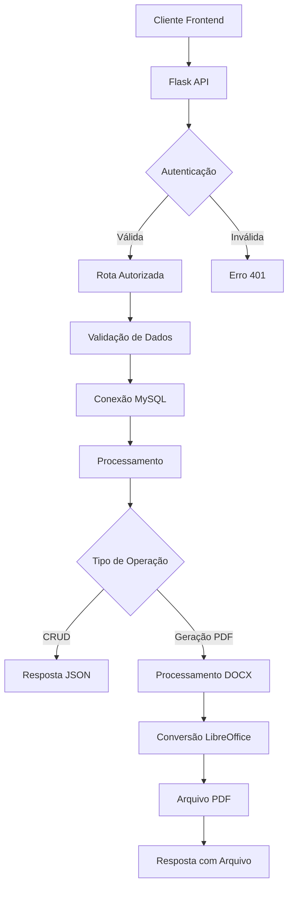

# SISTEMA DE FREQUÊNCIA WEB - BACK-END

## 📋 Visão Geral

Este é um sistema web robusto para gestão completa de frequência de servidores públicos e estagiários, desenvolvido especificamente para órgãos públicos que necessitam de controle rigoroso de ponto eletrônico e geração automatizada de relatórios de frequência.

O sistema foi desenvolvido em **Python** com **Flask**, utiliza **MySQL** como banco de dados e possui capacidade de geração automatizada de documentos em **PDF** a partir de modelos **DOCX** pré-definidos. A aplicação oferece controle de acesso baseado em permissões, gestão completa de dados de pessoal e automação de processos burocráticos relacionados ao controle de frequência.

### 🎯 Objetivos do Sistema

- **Automatizar** a geração de folhas de frequência mensais
- **Centralizar** o controle de servidores e estagiários
- **Padronizar** documentos de frequência conforme normas do órgão
- **Facilitar** o arquivamento e recuperação de documentos
- **Agilizar** processos administrativos de RH
- **Garantir** integridade e rastreabilidade dos dados

---

## 🚀 Funcionalidades Principais

### 🔐 Autenticação e Autorização
- Sistema de login seguro com controle de sessão
- Controle de permissões por papel (admin/editor)
- Middleware de autenticação em todas as rotas protegidas
- Logout automático por inatividade

### 👥 Gestão de Pessoal
- **Servidores Públicos:**
  - Cadastro completo com dados funcionais
  - Controle de horários de trabalho
  - Gestão de férias e licenças
  - Histórico de alterações
- **Estagiários:**
  - Cadastro com dados específicos do estágio
  - Controle de carga horária
  - Período de estágio
  - Supervisor responsável

### 📄 Geração Automatizada de Documentos
- **Folhas de Frequência Individual:**
  - Geração a partir de modelos DOCX padronizados
  - Preenchimento automático de dados pessoais
  - Cálculo automático de dias úteis, feriados e finais de semana
  - Conversão automática para PDF
- **Geração em Lote:**
  - Processamento por setor completo
  - Geração simultânea para múltiplos funcionários
  - Compactação automática em arquivos ZIP
- **Controle de Períodos:**
  - Respeita período de 21 do mês atual a 20 do próximo mês
  - Integração com calendário de feriados nacionais e municipais
  - Identificação automática de pontos facultativos

### 📊 Relatórios e Controles
- Listagem de PDFs gerados por período
- Histórico completo de ações do sistema
- Visualização online de documentos
- Download individual ou em lote
- Controle de status (ativo/arquivado)

### 🗂️ Organização de Arquivos
- Estrutura hierárquica por setor e mês
- Nomenclatura padronizada de arquivos
- Compactação automática por setor
- Sistema de limpeza de arquivos temporários

---

## 🏗️ Arquitetura e Estrutura do Projeto

### 📁 Estrutura de Diretórios

```
SISTEMA-DE-FREQUENCIA-WEB-BACK-END/
├── 🔧 Arquivos de Configuração
│   ├── main.py                     # Arquivo principal da aplicação Flask
│   ├── auth.py                     # Sistema de autenticação e autorização
│   ├── conection_mysql.py          # Configuração de conexão com MySQL
│   ├── decorador.py                # Decoradores customizados para autorização
│   ├── chave_secreta.py            # Chaves secretas e configurações sensíveis
│   ├── requirements.txt            # Dependências Python do projeto
│   ├── Dockerfile                  # Configuração Docker
│   └── docker-compose.yml          # Orquestração de containers
│
├── 📄 Modelos de Documentos
│   ├── FREQUÊNCIA_MENSAL.docx              # Modelo para servidores
│   ├── FREQUÊNCIA ESTAGIÁRIOS - MODELO.docx # Modelo para estagiários
│   └── FICHA_FUNCIONAL_TEMPLATE.xlsx       # Modelo de ficha funcional
│
├── 🗂️ Diretórios de Dados
│   ├── setor/                      # Arquivos organizados por setor
│   │   ├── GTI/                    # Exemplo de setor
│   │   └── estagiarios/            # Arquivos de estagiários
│   ├── uploads/                    # Arquivos enviados pelos usuários
│   ├── temp_files/                 # Arquivos temporários
│   └── arquivos-temporarios/       # Scripts e dados temporários
│
├── 🛣️ Rotas da API (routes/)
│   ├── __init__.py
│   │
│   ├── 👥 Gestão de Servidores
│   │   ├── criar_servidor.py              # Cadastro de novos servidores
│   │   ├── atualizar_servidores.py        # Atualização de dados
│   │   ├── arquivar.py                    # Arquivamento de servidores
│   │   ├── ativar_servidor.py             # Reativação de servidores
│   │   └── buscar_arquivados.py           # Listagem de arquivados
│   │
│   ├── 🎓 Gestão de Estagiários
│   │   ├── criar_estagiario.py            # Cadastro de estagiários
│   │   ├── atualizar_estagiario.py        # Atualização de dados
│   │   ├── arquivar_estagiario.py         # Arquivamento
│   │   ├── ativar_estagiario.py           # Reativação
│   │   └── buscar_arquivados_estagiarios.py
│   │
│   ├── 🔍 Consultas e Buscas
│   │   ├── buscar_todos.py                # Listagem geral
│   │   ├── buscar_estagiarios.py          # Busca específica de estagiários
│   │   ├── buscar_setor.py                # Busca por setor
│   │   └── busca_setor_estagiario.py      # Busca de estagiários por setor
│   │
│   ├── 📋 Geração de Documentos
│   │   ├── converte_servidor_pdf.py       # Conversão individual de servidor
│   │   ├── converte_estagiario.py         # Conversão individual de estagiário
│   │   ├── converte_setores_pdf.py        # Conversão em lote de setores
│   │   ├── converter_setor_estagiarios.py # Conversão de estagiários por setor
│   │   ├── gerar_ficha_funcional.py       # Geração de fichas funcionais
│   │   └── documento_routes.py            # Gestão de documentos gerais
│   │
│   ├── 📁 Gestão de Arquivos
│   │   ├── listar_pdfs.py                 # Listagem de PDFs de servidores
│   │   ├── listar_pdfs_estagiarios.py     # Listagem de PDFs de estagiários
│   │   ├── visualizar_pdf.py              # Visualização online
│   │   ├── visualiza_arquivo_servidor.py  # Visualização específica
│   │   ├── visualiza_arquivo_estagiario.py
│   │   └── limpar_pasta_setor.py          # Limpeza de arquivos
│   │
│   ├── 📤 Downloads e Envios
│   │   ├── send.py                        # Download individual
│   │   ├── send_setores.py                # Download por setor
│   │   ├── send_varios_setores.py         # Download múltiplos setores
│   │   ├── send_varios_setores_estagiario.py
│   │   ├── send_documentos.py             # Envio de documentos
│   │   └── send_ficha_funcional.py        # Envio de fichas funcionais
│   │
│   ├── 📅 Controles de Data
│   │   └── feriados_municipais.py         # Gestão de feriados
│   │
│   ├── 📊 Histórico e Logs
│   │   └── historico_logs/
│   │       ├── criar_historico.py         # Criação de logs
│   │       └── buscar_historico.py        # Consulta de histórico
│   │
│   └── 🚪 Autenticação
│       └── logout.py                      # Processo de logout
│
├── 🛠️ Utilitários (utils/)
│   ├── __init__.py
│   ├── convert_to_pdf.py                  # Conversão DOCX → PDF
│   ├── muda_texto_documento.py            # Substituição de placeholders
│   ├── formata_datas.py                   # Formatação de datas
│   ├── gerador_docx.py                    # Geração de documentos DOCX
│   └── gerador_excel.py                   # Geração de planilhas Excel
│
├── ✅ Validadores (validators/)
│   ├── __init__.py
│   ├── criar_servidor_validator.py        # Validação de dados de servidor
│   └── criar_estagiario_validator.py      # Validação de dados de estagiário
│
└── 🐍 Ambiente Virtual
    └── meuambiente/                       # Ambiente Python isolado
```

### 🔗 Fluxo de Dados



---

## ⚙️ Instalação e Configuração

### 📋 Pré-requisitos do Sistema

Antes de instalar o sistema, certifique-se de que o ambiente atende aos seguintes requisitos:

#### Software Obrigatório:
- **Python 3.12+** - Linguagem de programação principal
- **MySQL 8.0+** - Sistema de gerenciamento de banco de dados
- **LibreOffice 7.0+** - Para conversão de documentos DOCX para PDF
- **Git** - Para controle de versão e clonagem do repositório

#### Software Opcional:
- **Docker & Docker Compose** - Para implantação em containers
- **nginx** - Para servir como proxy reverso em produção

### 🔧 Instalação Manual (Ambiente Linux)

#### 1. Preparação do Ambiente

```bash
# Atualizar sistema (Ubuntu/Debian)
sudo apt update && sudo apt upgrade -y

# Instalar dependências do sistema
sudo apt install -y python3.12 python3.12-venv python3-pip git mysql-server libreoffice

# Verificar versões instaladas
python3.12 --version
mysql --version
libreoffice --version
```

#### 2. Clonagem do Repositório

```bash
# Navegar para o diretório de projetos
cd /home/seu_usuario/projetos/

# Clonar o repositório
git clone https://github.com/seu-usuario/SISTEMA-DE-FREQUENCIA-WEB-BACK-END.git
cd SISTEMA-DE-FREQUENCIA-WEB-BACK-END
```

#### 3. Configuração do Ambiente Virtual Python

```bash
# Criar ambiente virtual
python3.12 -m venv meuambiente

# Ativar ambiente virtual
source meuambiente/bin/activate

# Atualizar pip
pip install --upgrade pip

# Instalar dependências do projeto
pip install -r requirements.txt
```

#### 4. Configuração do Banco de Dados

Ajustar as configurações conforme seu ambiente:

```python
def connect_mysql():
    try:
        connection = mysql.connector.connect(
            host="1.1.1.1",          # ou IP do servidor MySQL
            user="usuario",              # usuário criado
            password="senha_super_secreta",    # senha definida
            database="banco_de_dados",
            charset='utf8mb4',
            autocommit=True
        )
        return connection
    except Error as e:
        print(f"Erro ao conectar ao MySQL: {e}")
        return None
```

#### 6. Configuração das Chaves Secretas

```bash
# Editar arquivo de chaves secretas
nano chave_secreta.py
```

```python
# Gerar chave secreta segura
import secrets

# Chave para sessões Flask
SECRET_KEY = secrets.token_hex(32)

# Outras configurações sensíveis
DATABASE_PASSWORD = "senha_super_secreta"
JWT_SECRET = secrets.token_hex(64)
```

#### 8. Inicialização da Aplicação

```bash
# Ativar ambiente virtual (se não estiver ativo)
source meuambiente/bin/activate

# Executar aplicação em modo desenvolvimento
python main.py

# Verificar se a aplicação está rodando
curl http://localhost:5000/api/status
```

### 🐳 Instalação com Docker

#### 1. Preparação dos Arquivos Docker

Verifique se os arquivos `Dockerfile` e `docker-compose.yml` estão configurados corretamente:

**Dockerfile:**
```dockerfile
FROM python:3.12-slim

# Instalar LibreOffice e dependências
RUN apt-get update && apt-get install -y \
    libreoffice \
    default-mysql-client \
    && rm -rf /var/lib/apt/lists/*

WORKDIR /app

# Copiar requirements primeiro para aproveitar cache do Docker
COPY requirements.txt .
RUN pip install --no-cache-dir -r requirements.txt

# Copiar código da aplicação
COPY . .

# Criar diretórios necessários
RUN mkdir -p setor/estagiarios temp_files uploads

# Expor porta
EXPOSE 5000

# Comando de inicialização
CMD ["python", "main.py"]
```

**docker-compose.yml:**
```yaml
version: '3.8'

services:
  app:
    build: .
    ports:
      - "5000:5000"
    environment:
      - FLASK_ENV=production
      - DATABASE_HOST=db
    depends_on:
      - db
    volumes:
      - ./setor:/app/setor
      - ./uploads:/app/uploads
      - ./temp_files:/app/temp_files

  db:
    image: mysql:8.0
    environment:
      MYSQL_DATABASE: sistema_frequenciarh
      MYSQL_USER: devop
      MYSQL_PASSWORD: DEVsjc@2025
      MYSQL_ROOT_PASSWORD: rootpassword
    ports:
      - "3306:3306"
    volumes:
      - mysql_data:/var/lib/mysql

volumes:
  mysql_data:
```

#### 2. Execução com Docker

```bash
# Construir e iniciar containers
docker-compose up --build -d

# Verificar status dos containers
docker-compose ps

# Verificar logs
docker-compose logs -f app

# Parar containers
docker-compose down
```

### 🔒 Configurações de Segurança

#### 1. Configuração de Firewall

```bash
# Ubuntu/Debian - UFW
sudo ufw allow 5000/tcp  # Porta da aplicação
sudo ufw allow 3306/tcp  # Porta MySQL (apenas se necessário)
sudo ufw enable
```

#### 2. Configuração SSL/HTTPS (Produção)

Para produção, configure um proxy reverso com nginx:

```nginx
server {
    listen 80;
    server_name seu-dominio.com;
    return 301 https://$server_name$request_uri;
}

server {
    listen 443 ssl;
    server_name seu-dominio.com;
    
    ssl_certificate /path/to/certificate.crt;
    ssl_certificate_key /path/to/private.key;
    
    location / {
        proxy_pass http://localhost:5000;
        proxy_set_header Host $host;
        proxy_set_header X-Real-IP $remote_addr;
        proxy_set_header X-Forwarded-For $proxy_add_x_forwarded_for;
        proxy_set_header X-Forwarded-Proto $scheme;
    }
}
```

### 🧪 Teste da Instalação

Execute os seguintes testes para verificar se a instalação foi bem-sucedida:

```bash
# Teste de conexão com banco de dados
python -c "from conection_mysql import connect_mysql; print('Conexão OK' if connect_mysql() else 'Falha na conexão')"

# Teste de conversão PDF
python -c "from utils.convert_to_pdf import convert_to_pdf; print('LibreOffice OK')"

# Teste de importação de módulos
python -c "import flask, mysql.connector, docx; print('Dependências OK')"

# Teste da aplicação
curl -X GET http://localhost:5000/api/status
```

---

## 📦 Gerenciamento de Dependências - requirements.txt

### 🎯 O que é o requirements.txt?

O arquivo `requirements.txt` é o coração do gerenciamento de dependências em projetos Python. Ele lista todas as bibliotecas externas necessárias para o funcionamento da aplicação, incluindo suas versões específicas, garantindo reprodutibilidade e estabilidade do ambiente.

### 📋 Principais Dependências do Projeto

#### 🌐 Framework Web e APIs
```pip-requirements
flask==3.1.0                    # Framework web principal
flask-cors==5.0.0               # Controle de CORS para APIs
Flask-Login==0.6.3              # Sistema de autenticação de usuários
Werkzeug==3.1.3                 # Utilitários WSGI para Flask
```

#### 🗄️ Banco de Dados
```pip-requirements
mysql-connector-python==9.3.0   # Conector oficial MySQL para Python
SQLAlchemy==2.0.38              # ORM para Python (se usado)
```

#### 📄 Processamento de Documentos
```pip-requirements
python-docx==1.1.2              # Manipulação de arquivos DOCX
openpyxl==3.1.5                 # Leitura/escrita de arquivos Excel
PyPDF2==3.0.1                   # Manipulação de arquivos PDF (se necessário)
lxml==5.3.1                     # Parser XML/HTML para processamento de docs
```

#### 📅 Manipulação de Datas e Feriados
```pip-requirements
python-dateutil==2.9.0.post0    # Extensões avançadas para datetime
holidays==0.73                  # Biblioteca de feriados nacionais e regionais
pytz==2025.1                    # Fusos horários
tzdata==2025.1                  # Dados de fuso horário
```

#### 🔐 Segurança e Criptografia
```pip-requirements
bcrypt==3.2.2                   # Hash seguro de senhas
PyJWT==2.10.1                   # JSON Web Tokens para autenticação
```

#### 📊 Análise de Dados (se utilizado)
```pip-requirements
pandas==2.2.3                   # Análise e manipulação de dados
numpy==2.2.3                    # Computação numérica
```

#### 🛠️ Utilitários e Ferramentas
```pip-requirements
requests==2.32.3                # Cliente HTTP
pillow==11.1.0                  # Manipulação de imagens
tqdm==4.67.1                    # Barras de progresso
```

#### ✅ Validação de Dados
```pip-requirements
Cerberus==1.3.7                 # Validação de esquemas de dados
```

### 🔧 Como Adicionar Novas Dependências

#### Método 1: Instalação Manual

```bash
# Ativar ambiente virtual
source meuambiente/bin/activate

# Instalar nova biblioteca
pip install nome-da-biblioteca==versao

# Atualizar requirements.txt
pip freeze > requirements.txt
```

#### Método 2: Edição Direta (Recomendado)

```bash
# Editar arquivo requirements.txt
nano requirements.txt

# Adicionar nova linha com a dependência
nova-biblioteca==1.0.0

# Instalar dependências atualizadas
pip install -r requirements.txt
```

#### Método 3: Usando pipreqs (Gerar automaticamente)

```bash
# Instalar pipreqs
pip install pipreqs

# Gerar requirements.txt baseado no código
pipreqs . --force

# Revisar e ajustar versões se necessário
nano requirements.txt
```

### 📌 Boas Práticas para requirements.txt

#### 1. **Fixação de Versões (Version Pinning)**
```pip-requirements
# ✅ Recomendado - Versão específica
flask==3.1.0

# ⚠️ Evitar - Pode causar incompatibilidades
flask>=3.0.0

# ❌ Nunca usar - Versão mais recente sempre
flask
```

#### 2. **Organização por Categoria**
```pip-requirements
# === FRAMEWORK WEB ===
flask==3.1.0
flask-cors==5.0.0
Flask-Login==0.6.3

# === BANCO DE DADOS ===
mysql-connector-python==9.3.0
SQLAlchemy==2.0.38

# === PROCESSAMENTO DE DOCUMENTOS ===
python-docx==1.1.2
openpyxl==3.1.5

# === DESENVOLVIMENTO (comentar em produção) ===
# pytest==7.4.0
# pytest-cov==4.1.0
```

#### 3. **Separação por Ambiente**

**requirements/base.txt** (Dependências comuns):
```pip-requirements
flask==3.1.0
mysql-connector-python==9.3.0
python-docx==1.1.2
```

**requirements/development.txt**:
```pip-requirements
-r base.txt
pytest==7.4.0
black==23.7.0
flake8==6.0.0
```

**requirements/production.txt**:
```pip-requirements
-r base.txt
gunicorn==21.2.0
```

### 🚀 Comandos Úteis para Gerenciamento

```bash
# Instalar todas as dependências
pip install -r requirements.txt

# Atualizar uma biblioteca específica
pip install --upgrade nome-da-biblioteca

# Verificar bibliotecas desatualizadas
pip list --outdated

# Verificar vulnerabilidades de segurança
pip audit

# Limpar cache do pip
pip cache purge

# Verificar dependências não utilizadas
pip-autoremove -y

# Gerar requirements com hash de segurança
pip freeze --all > requirements-secure.txt
```

### 🔍 Resolução de Problemas Comuns

#### Problema: Conflito de Versões
```bash
# Verificar dependências conflitantes
pip check

# Resolver manualmente editando requirements.txt
# ou usar pipdeptree para visualizar árvore de dependências
pip install pipdeptree
pipdeptree --graph-output png > dependencies.png
```

#### Problema: Bibliotecas Quebradas
```bash
# Reinstalar biblioteca específica
pip uninstall nome-da-biblioteca
pip install nome-da-biblioteca==versao

# Reinstalar todas as dependências
pip uninstall -r requirements.txt -y
pip install -r requirements.txt
```

#### Problema: Ambiente Corrompido
```bash
# Recriar ambiente virtual
deactivate
rm -rf meuambiente
python3.12 -m venv meuambiente
source meuambiente/bin/activate
pip install -r requirements.txt
```

### 📚 Dependências Específicas do Sistema

Algumas funcionalidades requerem software adicional no sistema operacional:

#### LibreOffice (Conversão de Documentos)
```bash
# Ubuntu/Debian
sudo apt install libreoffice

# CentOS/RHEL
sudo yum install libreoffice

# Verificar instalação
libreoffice --version
```

#### Fontes do Sistema (Para PDFs)
```bash
# Instalar fontes Microsoft (opcional)
sudo apt install ttf-mscorefonts-installer

# Fontes adicionais para melhor renderização
sudo apt install fonts-liberation fonts-dejavu
```

#### Dependências de Compilação (para algumas bibliotecas Python)
```bash
# Ubuntu/Debian
sudo apt install build-essential python3-dev libmysqlclient-dev

# CentOS/RHEL
sudo yum groupinstall "Development Tools"
sudo yum install python3-devel mysql-devel
```

---

## 🗂️ Arquivos Importantes e Suas Funções

### 🎯 Arquivos de Configuração Principal

#### `main.py` - Arquivo Central da Aplicação
```python
# Ponto de entrada da aplicação Flask
# Responsabilidades:
# - Inicialização do Flask
# - Registro de blueprints (rotas)
# - Configuração de CORS
# - Configuração de middlewares
# - Inicialização do sistema de login

from flask import Flask
from flask_cors import CORS
from auth import login_manager
# ... outras importações

app = Flask(__name__)
CORS(app, supports_credentials=True)
login_manager.init_app(app)
# ... registro de blueprints
```

#### `auth.py` - Sistema de Autenticação
```python
# Gerenciamento completo de autenticação
# Funcionalidades:
# - Classes de usuário
# - Decoradores de autorização
# - Login/logout
# - Controle de sessões
# - Verificação de permissões

from flask_login import LoginManager, UserMixin
from functools import wraps

class User(UserMixin):
    def __init__(self, user_id, username, role):
        self.id = user_id
        self.username = username
        self.role = role
```

#### `conection_mysql.py` - Conexão com Banco de Dados
```python
# Configuração centralizada de conexão MySQL
# Características:
# - Pool de conexões
# - Tratamento de erros
# - Configurações de charset
# - Timeout e retry

import mysql.connector
from mysql.connector import pooling

def connect_mysql():
    try:
        connection = mysql.connector.connect(
            host="12.90.1.2",
            user="devop", 
            password="DEVsjc@2025",
            database="sistema_frequenciarh",
            charset='utf8mb4',
            autocommit=True
        )
        return connection
    except Error as e:
        print(f"Erro ao conectar ao MySQL: {e}")
        return None
```

#### `decorador.py` - Decoradores Customizados
```python
# Decoradores para controle de acesso
# Tipos de decoradores:
# - @require_login - Requer usuário logado
# - @require_admin - Requer privilégios administrativos
# - @require_permission - Controle granular de permissões

from functools import wraps
from flask import jsonify, session

def require_login(f):
    @wraps(f)
    def decorated_function(*args, **kwargs):
        if 'user_id' not in session:
            return jsonify({'erro': 'Login necessário'}), 401
        return f(*args, **kwargs)
    return decorated_function
```

### 📄 Modelos de Documentos (Templates)

#### `FREQUÊNCIA_MENSAL.docx` - Modelo para Servidores
```
Estrutura do documento:
├── Cabeçalho com logo do órgão
├── Campos de substituição:
│   ├── CAMPO NOME (Nome do servidor)
│   ├── CAMPO SETOR (Setor de lotação)
│   ├── CAMPO MES (Período da frequência)
│   ├── CAMPO HORARIO (Horário de trabalho)
│   ├── CAMPO ENTRADA (Horário entrada)
│   └── CAMPO SAÍDA (Horário saída)
├── Tabela de frequência diária
│   ├── Coluna Dia
│   ├── Coluna Entrada Manhã
│   ├── Coluna Saída Manhã
│   ├── Coluna Entrada Tarde
│   └── Coluna Saída Tarde
└── Campos de assinatura
```

#### `FREQUÊNCIA ESTAGIÁRIOS - MODELO.docx` - Modelo para Estagiários
```
Estrutura específica para estagiários:
├── Dados do estagiário
├── Dados do supervisor
├── Período do estágio
├── Carga horária
├── Tabela de frequência simplificada
└── Campos de validação
```

### 🛠️ Utilitários Essenciais (utils/)

#### `convert_to_pdf.py` - Conversão de Documentos
```python
# Converte DOCX para PDF usando LibreOffice
# Características:
# - Conversão headless (sem interface)
# - Tratamento de erros
# - Timeout de segurança
# - Verificação de arquivo resultante

def convert_to_pdf(input_path, output_folder):
    command = [
        'soffice',
        '--headless',
        '--convert-to', 'pdf',
        '--outdir', output_folder,
        input_path
    ]
    
    process = subprocess.run(
        command, 
        check=True, 
        capture_output=True, 
        text=True, 
        timeout=60
    )
```

#### `muda_texto_documento.py` - Substituição de Placeholders
```python
# Substitui campos no documento DOCX
# Funcionalidades:
# - Busca em parágrafos e tabelas
# - Preserva formatação
# - Alinhamento centralizado
# - Tratamento de múltiplas ocorrências

def muda_texto_documento(doc, campo, valor):
    # Buscar em parágrafos
    for p in doc.paragraphs:
        if campo in p.text:
            novo_texto = p.text.replace(campo, valor)
            p.clear()
            p.add_run(novo_texto)
            p.alignment = WD_PARAGRAPH_ALIGNMENT.CENTER
    
    # Buscar em tabelas
    for table in doc.tables:
        for row in table.rows:
            for cell in row.cells:
                for p in cell.paragraphs:
                    if campo in p.text:
                        # ... substituição
```

#### `formata_datas.py` - Manipulação de Datas
```python
# Funções para formatação e cálculo de datas
# Funcionalidades:
# - Formatação de datas por extenso
# - Cálculo de dias úteis
# - Identificação de finais de semana
# - Integração com feriados

def data_atual(mes_input):
    """Retorna dados formatados do mês"""
    return {
        'mes': 'Janeiro',
        'mes_numerico': 1,
        'ano': 2025
    }

def pega_final_de_semana(ano, mes, dia):
    """Retorna dia da semana (0=segunda, 6=domingo)"""
    data = datetime(ano, mes, dia)
    return data.weekday()
```

### 🛣️ Rotas Principais (routes/)

#### Rotas de Conversão de Documentos

**`converter_setor_estagiarios.py`** - Conversão em Lote de Estagiários
```python
# Funcionalidades principais:
# 1. Busca estagiários por setor
# 2. Gera documento individual para cada um
# 3. Aplica regras de período (21 a 20)
# 4. Calcula feriados e finais de semana
# 5. Converte para PDF
# 6. Compacta em ZIP por setor

@bp_converte_setor_estagiario_pdf.route('/api/setores/estagiar/pdf', methods=['POST'])
def converte_setores_estagiarios_pdf():
    # Receber parâmetros (setores, mês)
    # Validar entrada
    # Para cada setor:
    #   - Buscar estagiários ativos
    #   - Gerar documentos individuais
    #   - Converter para PDF
    #   - Criar ZIP do setor
    # Retornar ZIP final
```

**`converte_servidor_pdf.py`** - Conversão Individual
```python
# Conversão de servidor específico
# Processo:
# 1. Validação de dados de entrada
# 2. Busca dados do servidor no banco
# 3. Carregamento do template DOCX
# 4. Substituição de placeholders
# 5. Geração da tabela de dias
# 6. Conversão para PDF
# 7. Retorno do arquivo
```

#### Rotas de Gestão de Dados

**`criar_servidor.py`** - Cadastro de Servidores
```python
# Validação e criação de novos servidores
# Validações:
# - Campos obrigatórios
# - Formato de dados
# - Duplicação de registros
# - Integridade referencial

@bp_criar_servidor.route('/api/criar/servidores', methods=['POST'])
def criar_servidor():
    # Validar dados com Cerberus
    # Verificar duplicatas
    # Inserir no banco
    # Criar log da ação
    # Retornar confirmação
```

### 🔍 Validadores (validators/)

#### `criar_servidor_validator.py` - Validação de Servidores
```python
# Schema de validação usando Cerberus
servidor_schema = {
    'nome': {
        'type': 'string',
        'required': True,
        'minlength': 2,
        'maxlength': 255
    },
    'setor': {
        'type': 'string', 
        'required': True,
        'allowed': ['GTI', 'RH', 'FINANCEIRO', 'JURIDICO']
    },
    'horario_entrada': {
        'type': 'string',
        'regex': '^([01]?[0-9]|2[0-3]):[0-5][0-9]$'
    }
}
```

### 📊 Estrutura de Dados (Banco de Dados)

#### Tabelas Principais

**servidores** - Dados dos Servidores Públicos
```sql
CREATE TABLE servidores (
    id INT AUTO_INCREMENT PRIMARY KEY,
    nome VARCHAR(255) NOT NULL,
    setor VARCHAR(100) NOT NULL,
    cargo VARCHAR(100),
    horario_entrada TIME,
    horario_saida TIME,
    horario VARCHAR(50),              -- Descrição textual do horário
    feriasinicio DATE,                -- Início das férias
    feriasfinal DATE,                 -- Fim das férias
    status ENUM('ativo', 'arquivado') DEFAULT 'ativo',
    created_at TIMESTAMP DEFAULT CURRENT_TIMESTAMP,
    updated_at TIMESTAMP DEFAULT CURRENT_TIMESTAMP ON UPDATE CURRENT_TIMESTAMP
);
```

**estagiarios** - Dados dos Estagiários
```sql
CREATE TABLE estagiarios (
    id INT AUTO_INCREMENT PRIMARY KEY,
    nome VARCHAR(255) NOT NULL,
    setor VARCHAR(100) NOT NULL,
    cargo VARCHAR(100),
    horario_entrada TIME,
    horario_saida TIME,
    horario VARCHAR(50),
    feriasinicio DATE,
    feriasfinal DATE,
    periodo_inicio DATE,              -- Início do estágio
    periodo_fim DATE,                 -- Fim do estágio
    supervisor VARCHAR(255),          -- Nome do supervisor
    status ENUM('ativo', 'arquivado') DEFAULT 'ativo',
    created_at TIMESTAMP DEFAULT CURRENT_TIMESTAMP,
    updated_at TIMESTAMP DEFAULT CURRENT_TIMESTAMP ON UPDATE CURRENT_TIMESTAMP
);
```

**arquivos_pdf** - Controle de Arquivos Gerados
```sql
CREATE TABLE arquivos_pdf (
    id INT AUTO_INCREMENT PRIMARY KEY,
    servidor_id INT NULL,
    estagiario_id INT NULL,
    caminho_pdf VARCHAR(500) NOT NULL,
    mes_referencia VARCHAR(50),
    created_at TIMESTAMP DEFAULT CURRENT_TIMESTAMP,
    FOREIGN KEY (servidor_id) REFERENCES servidores(id) ON DELETE CASCADE,
    FOREIGN KEY (estagiario_id) REFERENCES estagiarios(id) ON DELETE CASCADE
);
```

**feriados_municipais** - Calendário de Feriados
```sql
CREATE TABLE feriados_municipais (
    id INT AUTO_INCREMENT PRIMARY KEY,
    data DATE NOT NULL,
    descricao VARCHAR(255),
    estado VARCHAR(2) DEFAULT 'AM',
    ponto_facultativo BOOLEAN DEFAULT FALSE,
    created_at TIMESTAMP DEFAULT CURRENT_TIMESTAMP,
    UNIQUE KEY unique_feriado (data, estado)
);
```

### 🔧 Configurações Avançadas

#### Configuração de CORS (`main.py`)
```python
# Configuração específica para intranet
CORS(app, supports_credentials=True, origin_regex=r"http://12\.90\.4\.\d+:8081")

@app.after_request
def after_request(response):
    # Headers adicionais de segurança
    response.headers['X-Content-Type-Options'] = 'nosniff'
    response.headers['X-Frame-Options'] = 'DENY'
    response.headers['X-XSS-Protection'] = '1; mode=block'
    return response
```

#### Configuração de Sessões
```python
# Configurações de segurança para sessões
app.config['SESSION_COOKIE_SECURE'] = True      # HTTPS only
app.config['SESSION_COOKIE_HTTPONLY'] = True    # JavaScript não pode acessar
app.config['SESSION_COOKIE_SAMESITE'] = 'Lax'   # Proteção CSRF
app.config['PERMANENT_SESSION_LIFETIME'] = timedelta(hours=8)
```

---

## 🛣️ Endpoints da API - Guia Completo

### 🔐 Autenticação e Autorização

#### `POST /login`
**Descrição**: Autenticação de usuário no sistema  
**Autorização**: Pública  
**Payload**:
```json
{
    "username": "admin",
    "password": "senha123"
}
```
**Resposta de Sucesso (200)**:
```json
{
    "message": "Login realizado com sucesso",
    "user": {
        "id": 1,
        "username": "admin",
        "role": "admin"
    }
}
```
**Resposta de Erro (401)**:
```json
{
    "erro": "Credenciais inválidas"
}
```

#### `POST /logout`
**Descrição**: Encerramento da sessão do usuário  
**Autorização**: Usuário logado  
**Resposta (200)**:
```json
{
    "message": "Logout realizado com sucesso"
}
```

---

### 👥 Gestão de Servidores

#### `GET /api/servidores`
**Descrição**: Listagem de servidores ativos  
**Autorização**: Usuário logado  
**Parâmetros de Query**:
- `setor` (opcional): Filtrar por setor específico
- `status` (opcional): ativo/arquivado (padrão: ativo)

**Resposta (200)**:
```json
{
    "servidores": [
        {
            "id": 1,
            "nome": "João Silva",
            "setor": "GTI",
            "cargo": "Analista de Sistemas",
            "horario_entrada": "08:00",
            "horario_saida": "17:00",
            "status": "ativo"
        }
    ]
}
```

#### `POST /api/criar/servidores`
**Descrição**: Cadastro de novo servidor  
**Autorização**: Admin ou Editor  
**Payload**:
```json
{
    "nome": "Maria Santos",
    "setor": "RH",
    "cargo": "Analista de RH",
    "horario_entrada": "08:00",
    "horario_saida": "17:00",
    "horario": "08:00 às 17:00",
    "feriasinicio": "2025-01-15",
    "feriasfinal": "2025-01-29"
}
```

#### `PUT /api/servidores/<id>`
**Descrição**: Atualização de dados do servidor  
**Autorização**: Admin ou Editor  

#### `PATCH /api/servidores/<id>/arquivar`
**Descrição**: Arquivamento de servidor  
**Autorização**: Admin  

#### `PATCH /api/servidores/<id>/atualizar-status`
**Descrição**: Reativação de servidor arquivado  
**Autorização**: Admin  

---

### 🎓 Gestão de Estagiários

#### `GET /api/estagiarios`
**Descrição**: Listagem de estagiários  
**Autorização**: Usuário logado  
**Parâmetros similares aos servidores**

#### `POST /api/estagiarios`
**Descrição**: Cadastro de novo estagiário  
**Autorização**: Admin ou Editor  
**Payload**:
```json
{
    "nome": "Ana Clara",
    "setor": "GTI",
    "cargo": "Estagiário TI",
    "horario_entrada": "13:00",
    "horario_saida": "17:00",
    "periodo_inicio": "2025-01-01",
    "periodo_fim": "2025-06-30",
    "supervisor": "João Silva"
}
```

#### `PATCH /api/estagiarios/<id>/arquivar`
**Descrição**: Arquivamento de estagiário  

#### `PATCH /api/estagiarios/<id>/atualizar-status`
**Descrição**: Reativação de estagiário  

---

### 📋 Geração de Documentos de Frequência

#### `POST /api/servidores/pdf`
**Descrição**: Geração de PDFs individuais para servidores selecionados  
**Autorização**: Admin ou Editor  
**Payload**:
```json
{
    "servidor_ids": [1, 2, 3],
    "mes": "Janeiro"
}
```
**Resposta**: Download direto do ZIP contendo PDFs

#### `POST /api/estagiario/pdf`
**Descrição**: Geração de PDFs individuais para estagiários selecionados  
**Payload**:
```json
{
    "estagiario_ids": [1, 2],
    "mes": "Janeiro"
}
```

#### `POST /api/setores/pdf`
**Descrição**: Geração em lote para todos servidores de setores específicos  
**Payload**:
```json
{
    "setores": ["GTI", "RH"],
    "mes": "Janeiro"
}
```

#### `POST /api/setores/estagiar/pdf`
**Descrição**: Geração em lote para todos estagiários de setores específicos  
**Payload**:
```json
{
    "setores": ["GTI", "FINANCEIRO"],
    "mes": "Janeiro"
}
```

---

### 📁 Gestão e Visualização de Arquivos

#### `GET /api/servidores/pdf/list`
**Descrição**: Listagem de PDFs de servidores gerados  
**Parâmetros**:
- `mes`: Mês de referência
- `setor` (opcional): Filtrar por setor

**Resposta (200)**:
```json
{
    "arquivos": [
        {
            "id": 1,
            "servidor_nome": "João Silva",
            "setor": "GTI",
            "mes": "Janeiro",
            "caminho": "/setor/GTI/JOAO_SILVA_FREQUENCIA.pdf",
            "data_criacao": "2025-01-15T10:30:00"
        }
    ]
}
```

#### `GET /api/estagiarios/pdf/list`
**Descrição**: Listagem de PDFs de estagiários gerados  

#### `GET /api/servidores/pdf/view`
**Descrição**: Visualização online de PDF de servidor  
**Parâmetros**:
- `setor`: Setor do servidor
- `mes`: Mês de referência  
- `nome`: Nome do servidor

**Resposta**: Stream do arquivo PDF para visualização no browser

#### `GET /api/estagiarios/pdf/view`
**Descrição**: Visualização online de PDF de estagiário  

#### `GET /api/servidores/pdf/download-zip/<mes>`
**Descrição**: Download de ZIP com todos PDFs de servidores do mês  

#### `GET /api/estagiarios/pdf/download-zip/<mes>`
**Descrição**: Download de ZIP com todos PDFs de estagiários do mês  

---

### 🔍 Consultas e Buscas

#### `GET /api/setores`
**Descrição**: Lista todos os setores cadastrados  
**Resposta (200)**:
```json
{
    "setores": ["GTI", "RH", "FINANCEIRO", "JURIDICO", "PROTOCOLO"]
}
```

#### `GET /api/buscar/arquivados`
**Descrição**: Lista servidores arquivados  

#### `GET /api/buscar/arquivados/estagiarios`
**Descrição**: Lista estagiários arquivados  

#### `GET /api/setor/<setor_nome>/servidores`
**Descrição**: Busca servidores de um setor específico  

#### `GET /api/setor/<setor_nome>/estagiarios`
**Descrição**: Busca estagiários de um setor específico  

---

### 📅 Gestão de Feriados

#### `GET /api/feriados`
**Descrição**: Lista feriados municipais cadastrados  
**Parâmetros**:
- `ano`: Ano de referência
- `estado`: Estado (padrão: AM)

#### `POST /api/feriados`
**Descrição**: Cadastro de novo feriado municipal  
**Autorização**: Admin  
**Payload**:
```json
{
    "data": "2025-04-23",
    "descricao": "São Jorge",
    "estado": "AM",
    "ponto_facultativo": false
}
```

---

### 📊 Histórico e Logs

#### `GET /api/historico`
**Descrição**: Consulta histórico de ações do sistema  
**Autorização**: Admin  
**Parâmetros**:
- `data_inicio`: Data inicial (YYYY-MM-DD)
- `data_fim`: Data final (YYYY-MM-DD)
- `usuario_id` (opcional): Filtrar por usuário
- `acao` (opcional): Filtrar por tipo de ação

**Resposta (200)**:
```json
{
    "historico": [
        {
            "id": 1,
            "usuario": "admin",
            "acao": "Geração de PDF",
            "detalhes": "PDF gerado para João Silva - Janeiro",
            "ip_address": "192.168.1.100",
            "data_hora": "2025-01-15T10:30:00"
        }
    ]
}
```

#### `POST /api/historico`
**Descrição**: Criação manual de entrada no histórico  
**Autorização**: Sistema interno  

---

### 🗂️ Gestão de Documentos Gerais

#### `GET /api/documentos`
**Descrição**: Lista documentos/templates disponíveis  

#### `POST /api/documentos/upload`
**Descrição**: Upload de novos templates  
**Autorização**: Admin  

#### `POST /api/ficha-funcional/gerar`
**Descrição**: Geração de ficha funcional  
**Payload**:
```json
{
    "servidor_id": 1,
    "mes": "Janeiro"
}
```

---

### 🧹 Utilitários

#### `POST /api/limpar-pasta/<setor>`
**Descrição**: Limpeza de arquivos temporários de um setor  
**Autorização**: Admin  

#### `GET /api/status`
**Descrição**: Status de saúde da aplicação  
**Resposta (200)**:
```json
{
    "status": "OK",
    "database": "connected",
    "libreoffice": "available",
    "version": "1.0.0",
    "uptime": "2 days, 5 hours"
}
```

---

## 🚀 Execução e Monitoramento

### Comandos de Execução

```bash
# Desenvolvimento
python main.py

# Produção com Gunicorn
gunicorn -w 4 -b 0.0.0.0:5000 main:app

# Com logs detalhados
gunicorn -w 4 -b 0.0.0.0:5000 --log-level debug main:app

# Usando Docker
docker-compose up -d
```

### Monitoramento de Logs

```bash
# Logs da aplicação
tail -f /var/log/sistema-frequencia/app.log

# Logs do MySQL
tail -f /var/log/mysql/error.log

# Logs do Docker
docker-compose logs -f app
```

### Backup e Manutenção

```bash
# Backup do banco de dados
mysqldump -u devop -p sistema_frequenciarh > backup_$(date +%Y%m%d).sql

# Limpeza de arquivos temporários (executar semanalmente)
find temp_files/ -name "*.tmp" -mtime +7 -delete
find setor/ -name "*.docx" -mtime +30 -delete

# Verificação de integridade dos arquivos
python scripts/verificar_integridade.py
```

---

## 🔒 Considerações de Segurança

### Configurações Recomendadas

1. **Banco de Dados**:
   - Usar usuário específico com privilégios mínimos
   - Configurar SSL para conexões
   - Backup automático diário

2. **Aplicação**:
   - Configurar HTTPS em produção
   - Implementar rate limiting
   - Logs de auditoria habilitados

3. **Servidor**:
   - Firewall configurado
   - Atualizações de segurança automáticas
   - Monitoramento de recursos

### Variáveis de Ambiente de Produção

```bash
# .env
FLASK_ENV=production
SECRET_KEY=sua_chave_super_secreta_aqui
DATABASE_HOST=localhost
DATABASE_USER=devop
DATABASE_PASSWORD=senha_forte
DATABASE_NAME=sistema_frequenciarh
CORS_ORIGINS=https://seu-dominio.com
```

---

## 📞 Suporte e Contribuição

### Reportar Problemas

Para reportar bugs ou solicitar funcionalidades:

1. Verifique se o problema já foi reportado
2. Inclua logs relevantes
3. Descreva os passos para reproduzir
4. Informe versão do sistema e ambiente

### Estrutura para Contribuições

```bash
# Fork do projeto
git clone https://github.com/seu-usuario/SISTEMA-DE-FREQUENCIA-WEB-BACK-END.git

# Criar branch para feature
git checkout -b feature/nova-funcionalidade

# Implementar mudanças
# Adicionar testes
# Atualizar documentação

# Commit e push
git commit -m "feat: adiciona nova funcionalidade X"
git push origin feature/nova-funcionalidade

# Abrir Pull Request
```

---

## 📄 Licença e Uso

### Licença

Este projeto é de **uso interno** do órgão público e contém informações sensíveis. 

**Restrições**:
- ❌ Não pode ser usado comercialmente
- ❌ Não pode ser redistribuído publicamente  
- ❌ Código-fonte não pode ser compartilhado externamente
- ✅ Pode ser adaptado para uso interno do órgão
- ✅ Pode ser usado para fins de desenvolvimento e teste

### Responsabilidades

- **Administrador do Sistema**: Manutenção, backups, segurança
- **Desenvolvedores**: Implementação de novas funcionalidades, correções
- **Usuários Finais**: Uso responsável, reporte de problemas

### Contato

Para questões técnicas ou suporte:
- **Email**: suporte-ti@orgao.gov.br
- **Telefone**: (92) 3000-0000
- **Horário de Suporte**: Segunda a Sexta, 8h às 17h

---

## 📈 Versionamento e Changelog

### Versão Atual: 1.0.0

#### v1.0.0 (2025-01-15)
- ✅ Sistema base de autenticação
- ✅ CRUD completo de servidores e estagiários
- ✅ Geração de PDFs individuais e em lote
- ✅ Sistema de arquivamento
- ✅ Integração com feriados municipais
- ✅ Histórico de ações

#### Próximas Versões Planejadas:

**v1.1.0** (Previsto: 2025-02-15)
- 🔄 Sistema de notificações por email
- 🔄 Relatórios estatísticos
- 🔄 Interface de configuração avançada

**v1.2.0** (Previsto: 2025-03-15)
- 🔄 API REST completa para integração
- 🔄 Sistema de assinatura digital
- 🔄 Módulo de aprovações

**v2.0.0** (Previsto: 2025-06-15)
- 🔄 Migração para arquitetura de microserviços
- 🔄 Interface web moderna (React/Vue)
- 🔄 Integração com sistemas corporativos

---

*Documentação atualizada em: {{ data_atual() }}*  
*Versão do Sistema: 1.0.0*  
*Responsável Técnico: Equipe GTI - SEJUSC*
